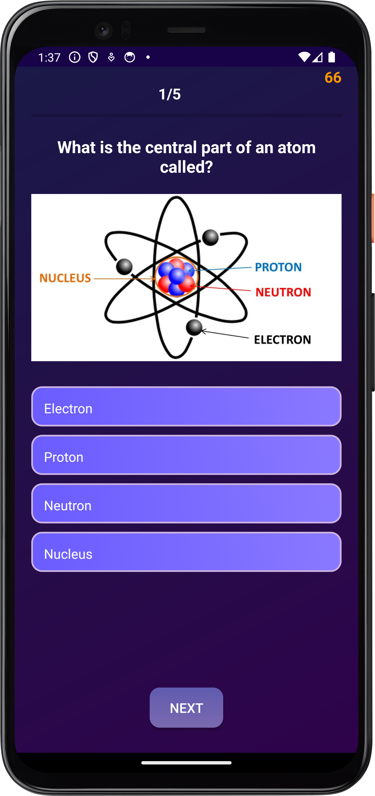
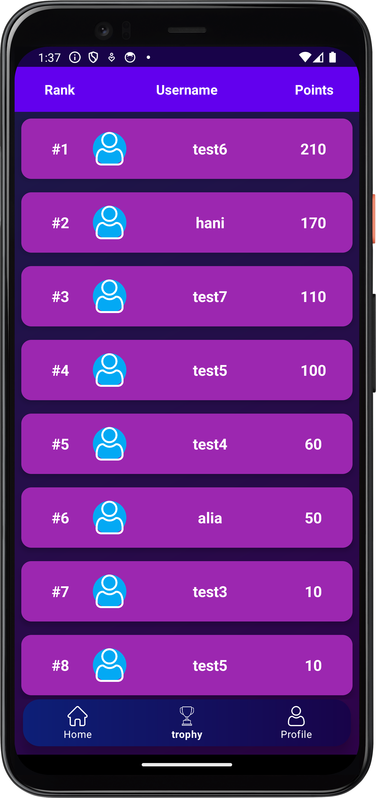

# ScienceQuest — Android Quiz App (Kotlin + Firebase)

ScienceQuest is a **mobile quiz application** built with **Kotlin** and **Firebase**, designed to deliver a smooth end-to-end quiz experience—from authentication and question flow to scoring and leaderboard ranking. This project demonstrates practical Android development skills including UI implementation, data modelling, Firebase integration, and clean project structuring.

## Highlights (What this project demonstrates)
- Kotlin-based Android app using Activities/Fragments and modular UI screens
- Firebase-backed user authentication and cloud data storage
- End-to-end quiz flow: attempt → scoring → feedback → ranking
- Structured codebase with adapters/models for maintainability

---

## Features
- **Authentication:** Login & Sign Up (Firebase Auth)
- **Quiz Flow:** Question navigation, answer selection, scoring logic *(timer if enabled)*
- **Result Feedback:** Correct/Wrong indication and score summary
- **Leaderboard:** Ranking display based on user performance (Firestore)
- **Profile:** Basic user/profile UI and data display
- **UI Assets:** Custom drawables and layouts for a consistent interface

---

## UI Preview
Small thumbnails below (click to view full size).

<table>
  <tr>
    <td align="center">
      <b>Home</b> 
      
    </td>
    <td align="center">
      <b>Quiz</b> 
      
    </td>
    <td align="center">
      <b>Leaderboard</b> 
      
    </td>
  </tr>
</table>

---

## Tech Stack
- **Language:** Kotlin
- **Platform:** Android
- **Backend:** Firebase Authentication, Firebase Firestore
- **UI:** AndroidX, XML layouts
- **Image Loading:** Glide 

---

## Project Structure (High Level)
- `app/src/main/java/` — Kotlin source code (Activities/Fragments, adapters, models)
- `app/src/main/res/` — layouts, drawables, values (UI resources)

---

## Setup (Run Locally)
1. Open the project in **Android Studio**
2. Wait for **Gradle Sync** to complete
3. Add Firebase configuration (required for auth/leaderboard):
   - Create a Firebase project and register an Android app
   - Download `google-services.json`
   - Place it at: `app/google-services.json`
4. Run the app on an emulator or physical device

---

## Firebase Configuration (Excluded)
This repo intentionally **does not include** `google-services.json` to avoid exposing project-specific Firebase configuration.

To enable Firebase features:
- Add your own `app/google-services.json`

---

## Skills Demonstrated
- Android app development with Kotlin (UI + navigation + state handling)
- Firebase Auth integration (user login/signup)
- Cloud database usage (Firestore CRUD for leaderboard/users)
- Clean project organization (models/adapters/screens separation)

---

## Notes
Build artifacts (e.g., `build/`, `.gradle/`, `.idea/`) should remain excluded from GitHub via `.gitignore`.
